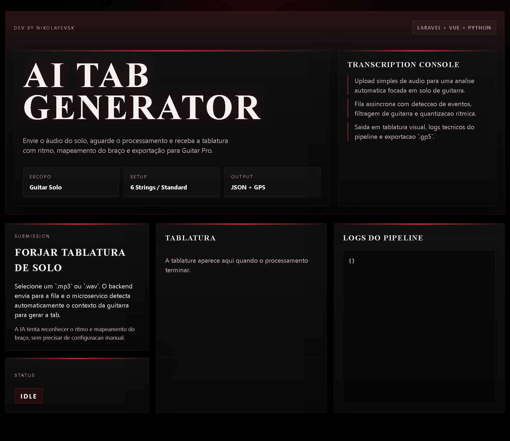

# AI Tab Generator

Monorepo para converter audio de guitarra em tablatura, com pipeline assincrono e arquitetura multi-stack.

## Visao geral

O projeto recebe um arquivo de audio (`.mp3`/`.wav`), processa as frequencias em um servico de IA e retorna uma tablatura estruturada para exibicao no frontend.

Objetivos principais:

- demonstrar IA aplicada em audio (DSP + heuristica)
- desacoplar orquestracao de API e processamento de audio
- construir base para exportacao futura (`.gp5` e MIDI)

## Stack

- `apps/frontend`: Vue 3 (Vite)
- `apps/backend`: Laravel 13 (API + fila)
- `apps/ai-service`: Python (FastAPI + librosa)
- `packages/shared`: contratos/tipos compartilhados

## Fluxo principal

1. Frontend envia audio para `POST /api/upload`.
2. Backend salva arquivo, cria `audio_jobs` e dispara `ProcessAudioJob`.
3. Job chama o servico Python em `POST /process-audio`.
4. Resultado (tablatura + logs) e persistido no backend.
5. Frontend consulta status/resultado em `GET /api/result/{job_id}`.

## Estrutura do repositorio

```txt
ai-tab-generator/
├── apps/
│   ├── backend/
│   ├── frontend/
│   └── ai-service/
├── packages/
│   └── shared/
└── docs/
```

## Como rodar localmente

### 1) Backend (Laravel API)

```bash
cd /var/www/projects/ai-tab-generator/apps/backend
php artisan migrate
php artisan serve
```

### 2) Worker de fila

```bash
cd /var/www/projects/ai-tab-generator/apps/backend
php artisan queue:work
```

### 3) Frontend

```bash
cd /var/www/projects/ai-tab-generator/apps/frontend
npm run dev
```

### 4) AI service

```bash
cd /var/www/projects/ai-tab-generator/apps/ai-service
python3 -m uvicorn app.main:app --reload --port 8001
```

## Persistencia local

No ambiente local atual, o backend usa SQLite para reduzir setup inicial e acelerar validacao do pipeline.

## Documentacao

A documentacao de produto, arquitetura e backlog fica em `docs/`:

- `docs/README.md`: indice da documentacao
- `docs/AI-TAB-README.md`: visao de produto e escopo original
- `docs/AI-TAB-ARCHITECTURE.md`: diretrizes de arquitetura e separacao de responsabilidades
- `docs/AI-TAB-AGENT.md`: definicao do `AudioToTabAgent`
- `docs/AI-TAB-TASKS.md`: tarefas e roadmap inicial
